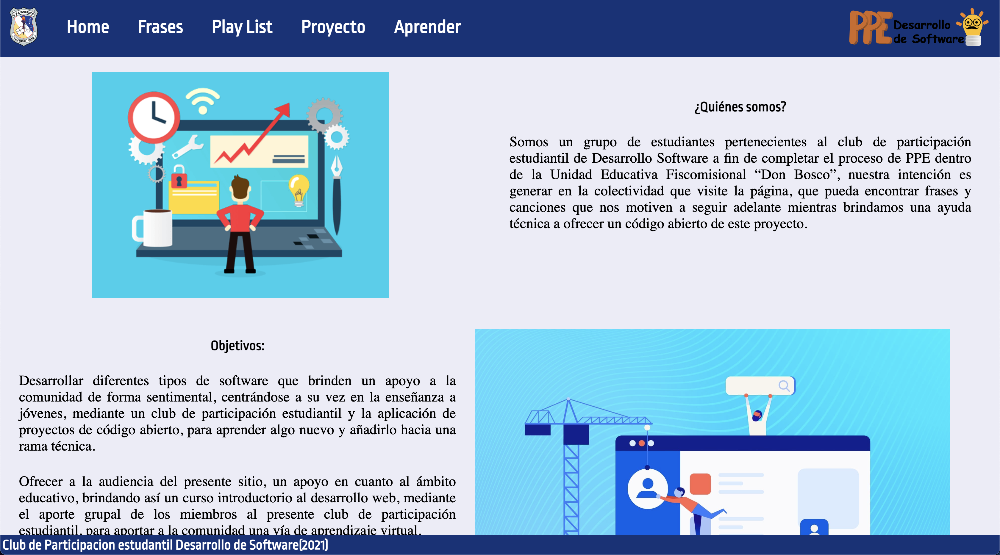

# PPE-Software - [OLD PROJECTS]

In 2021 I lead a static web page project about songs and quotes

## About

In 2021  I created the software development club at my high school, taking the rol of president and teacher, I taught the basics of programming and web development to my classmates and we developed a software for the school. This is the repository of the software we developed. I used to don't share my code at all, now I wanna create a collection with old projects and share them with the community as a way to show my progress and how I've evolved as a developer.

This project makes me happy, because I see how my classmates learned and how we worked together to create something useful for the school.

If some member of the club is reading this, I want to say that I'm proud of you, and I hope you are still coding and learning new things.

## Deployment

[Click here to see the project](https://cotbert2.github.io/PPE-Software/)